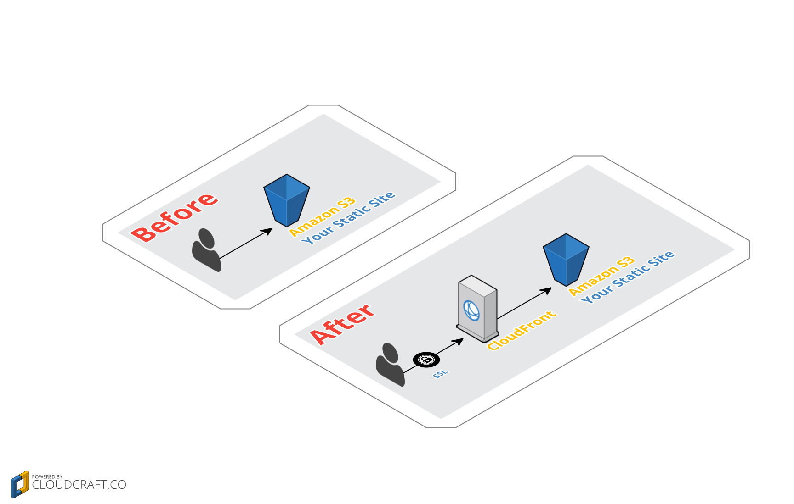

# Configuring a static S3 website to use CloudFront
To make your static website available over SSL you need to serve it through
Amazon's CDN, CloudFront. This adds minimal cost and makes your site faster for
your visitors as well. This document will detail how to set up your CloudFront
Distribution.

## Create a CloudFront Distribution
You need to create a CloudFront Distribution for your S3 website. Log in to the
[AWS Console](http://console.aws.amazon.com) and then navigate to the
[CloudFront management page](https://console.aws.amazon.com/cloudfront/home).

Click on "Create a Distribution", then select "Web Distribution". Fill out the
form paying attention to these fields:

* `Origin Domain Name` - Make sure you use your S3 HTTP endpoint, e.g.
  `BUCKET_NAME.s3-website-us-east-1.amazonaws.com`.  
  **NOTE**: Do *not* use the autocomplete dropdown to select your S3 bucket. If
  you do redirects or index documents will not work.

* `Price Class` - You may choose to reduce your cost by only using Edge
  Locations in certain regions.  
  Check the [CloudFront pricing page](https://aws.amazon.com/cloudfront/pricing/)
  for details.

* `Alternate Domain Names(CNAMEs)` - Make sure you enter your real domain name here.

* Leave the `SSL Certificate` setting alone. The Lambda function will take care of
  setting this appropriately.

* **Default Root Object** - Set this to the page you want loaded when visiting
  your bare domain(e.g. `index.html`)

* You may also want to adjust the cache settings to your liking, but this is all
  you need to get a working configuration

Click on the "Create Distribution" button and then wait for the "State" field
to change to "Deployed".

## Test that it works
Try visiting the `CloudFront Domain Name` which has been assigned to your
distribution, which will look something like `a1bcd123abc2.cloudfront.net`.
Your static S3 site should load and you can verify it is working.

## Update your DNS settings to point to your new CloudFront Distribution
Update your DNS settings to point to the `CloudFront Domain Name` your
Distribution has been assigned(Same domain as the testing step). Basically you
should be changing DNS to point to CloudFront instead of S3.

## Run the wizard
Go back to the main docs and run the wizard to set up SSL for your new
distribution with Lets-Encrypt.
